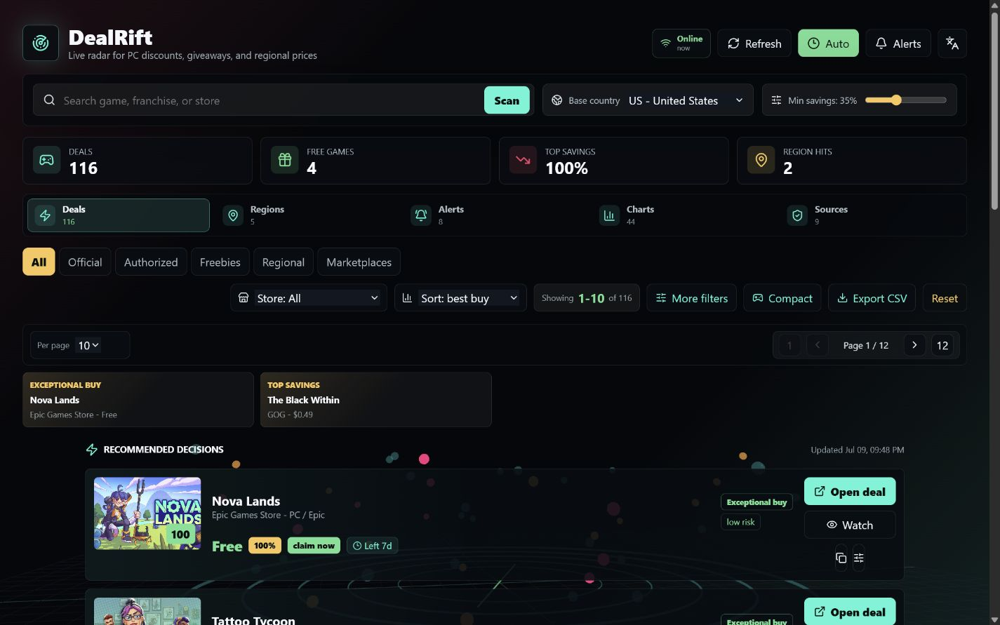
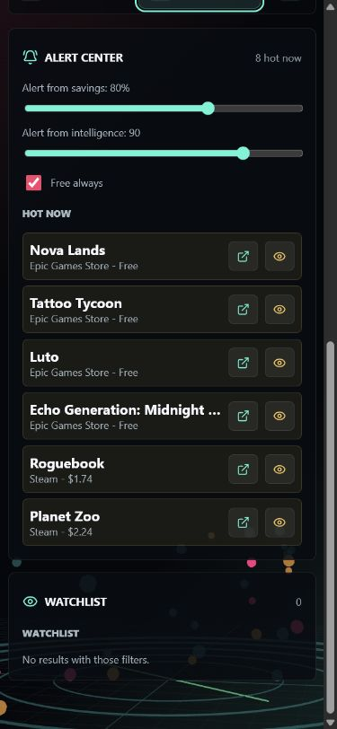

<div align="center">
  

# DealRift

**A local-first radar for PC game deals, giveaways, regional prices, and explainable offer intelligence.**

[](https://github.com/EazyHood/DealRift/actions/workflows/ci.yml)
[](https://github.com/EazyHood/DealRift/releases)
[](LICENSE)
[](https://github.com/EazyHood/DealRift/releases/download/v1.2.0-beta.1/DealRift-1.2.0-beta.1-portable.exe)

[](https://github.com/EazyHood/DealRift/releases/download/v1.2.0-beta.1/DealRift-1.2.0-beta.1-portable.exe)

**[Descargar .exe / Download .exe — v1.2.0-beta.1](https://github.com/EazyHood/DealRift/releases/download/v1.2.0-beta.1/DealRift-1.2.0-beta.1-portable.exe)**

[SHA-256 checksum](https://github.com/EazyHood/DealRift/releases/download/v1.2.0-beta.1/SHA256SUMS.txt) | [Release notes](https://github.com/EazyHood/DealRift/releases/tag/v1.2.0-beta.1) | [All releases](https://github.com/EazyHood/DealRift/releases) | [Report a bug](https://github.com/EazyHood/DealRift/issues/new/choose) | [Data sources](DATA_SOURCES.md) | [Privacy](PRIVACY.md)
</div>

> **Resumen en espanol:** DealRift compara ofertas reales, juegos gratis y precios regionales desde una interfaz disponible en espanol e ingles. **[Descarga aqui el `.exe` portable para Windows x64](https://github.com/EazyHood/DealRift/releases/download/v1.2.0-beta.1/DealRift-1.2.0-beta.1-portable.exe)**; no requiere instalador, terminal ni Node.js. El boton verde **Code > Download ZIP** descarga el codigo fuente, no la aplicacion.



## Download

DealRift currently ships as a portable **Windows x64** application:

1. **[Download DealRift-1.2.0-beta.1-portable.exe](https://github.com/EazyHood/DealRift/releases/download/v1.2.0-beta.1/DealRift-1.2.0-beta.1-portable.exe)**.
2. Download [SHA256SUMS.txt](https://github.com/EazyHood/DealRift/releases/download/v1.2.0-beta.1/SHA256SUMS.txt) from the same release.
3. Run the executable directly. It starts the UI and its private local API without a visible console.

If you prefer the release page, open [v1.2.0-beta.1](https://github.com/EazyHood/DealRift/releases/tag/v1.2.0-beta.1), expand **Assets**, and choose the `.exe`. The **Source code (zip/tar.gz)** files do not contain the built app. The download links above point to this beta explicitly because GitHub's `releases/latest` endpoint excludes pre-releases.

The public beta is not code signed yet, so Windows SmartScreen can display an unknown-publisher warning. Download only from this repository and verify the checksum:

```powershell
Get-FileHash .\DealRift-*-portable.exe -Algorithm SHA256
Get-Content .\SHA256SUMS.txt
```

The two hashes must match exactly.

## Highlights

- Live PC discounts from official and authorized stores, plus active and upcoming Epic giveaways.
- Steam price sampling across 24 countries with currency normalization and regional caveats.
- English and Spanish UI, source/store/country filters, price sorting, search, and pages of 10, 20, 30, or 40 games.
- Explainable deal verdicts based on observed history, market position, source confidence, risk, ratings, regional advantage, and urgency.
- Persistent personal library with watched and owned games, target prices, priorities, notes, and CSV/JSON import and backup.
- Independent watchlist checks, a persistent alert inbox, quiet hours, and optional Windows tray monitoring after the window closes.
- Game details with observed price history, country-specific evidence, store comparison and clearly identified stale or upcoming offers.
- Personal budget plans and an edition comparison workspace. Plans explain exclusions and use a deterministic priority-first strategy; they do not claim a mathematically optimal basket or unverified DLC contents.
- Validated destinations: CheapShark offers retain the provider's required deal redirects; official feeds use validated product links.
- Marketplace scouts for Eneba, CDKeys, Kinguin, G2A, GG.deals, AllKeyShop, and SteamDB, clearly labeled as searches rather than verified product listings.
- Responsive animated interface with a Three.js radar background and compact expandable deal rows.

<p align="center">
  
</p>

Read the [personal library guide](LIBRARY_GUIDE.md) for import formats, backups, targets, quiet hours and background monitoring.

## Deal intelligence

DealRift does not equate a large discount label with a good purchase. Each offer receives an evidence-aware score and a readable verdict. New installations begin in a collecting state; an observed low is not claimed until at least three observations spanning twelve hours exist.

Free offers are accepted only when the source data and current price agree. Regional savings are rewarded only when the sampled country actually beats the offer being evaluated. Cleaner or cheaper alternatives are grouped by normalized game edition without merging unrelated editions.

## Link and safety model

- Outbound links must use HTTPS and belong to a supported store domain.
- Unsafe protocols, embedded credentials, lookalike hosts, and arbitrary redirects are blocked. CheapShark's exact documented redirect endpoint is permitted with one validated deal ID.
- Exact product URLs, provider redirects and retailer search routes are labeled separately.
- The desktop API binds to `127.0.0.1` on a random port, restricts CORS, and serves a Content Security Policy.
- DealRift never asks for store credentials, payment details, activation keys, or browser cookies.

These checks reduce technical risk; they do not guarantee seller reputation, key validity, regional activation, refund eligibility, taxes, or account compatibility.

## Data sources

DealRift currently integrates CheapShark, Epic Games Store promotions, Steam Store endpoints, the GOG catalog, and Exchange Rate API. See [DATA_SOURCES.md](DATA_SOURCES.md) for purpose, limitations, link policy, and marketplace behavior.

DealRift is not affiliated with or endorsed by these providers. Store names, game names, trademarks, cover images, and catalog content belong to their respective owners.

## Development

Requirements: Node.js 20.19 or newer and npm.

```bash
git clone https://github.com/EazyHood/DealRift.git
cd DealRift
npm ci
npm run dev
```

Open `http://localhost:5173`. Vite proxies `/api` to the local backend on `http://localhost:5174`.

Useful commands:

```bash
npm run check      # lint, regression tests, and production build
npm run api        # local API only
npm run dist:win   # Windows x64 portable executable
npm run preview    # preview the production web build
```

## Architecture

```text
External sources
  -> source adapters and time-bounded fetches
  -> shared Deal model and clean-link policy
  -> deduplication, regional comparison, risk, and intelligence
  -> cached local Express API
  -> React interface, alerts, filters, charts, and exports
  -> sandboxed Electron portable application
```

Runtime observations are written atomically to the operating-system application data directory in packaged builds. Generated histories, executables, logs, and build output are intentionally excluded from Git.

API routes:

```text
GET /api/health
GET /api/history
GET /api/game-history?gameKey=<key>&country=<country>
GET /api/library
POST /api/library
POST /api/library/check
GET /api/stores
GET /api/regions/:appId
GET /api/radar
```

## Project status

DealRift is in public beta. External providers can change endpoints or terms, regional prices can require a compatible account and payment method, and marketplace searches require manual seller verification. See [PRIVACY.md](PRIVACY.md), [SECURITY.md](SECURITY.md), and the [changelog](CHANGELOG.md) before distributing modified builds.

Contributions are welcome through focused pull requests. Start with [CONTRIBUTING.md](CONTRIBUTING.md) and the technical workflow in [DEVELOPMENT_FLOW.md](DEVELOPMENT_FLOW.md).

## License

DealRift source code is available under the [MIT License](LICENSE).
